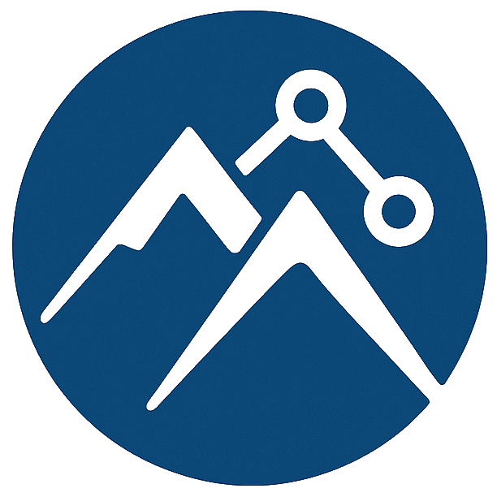
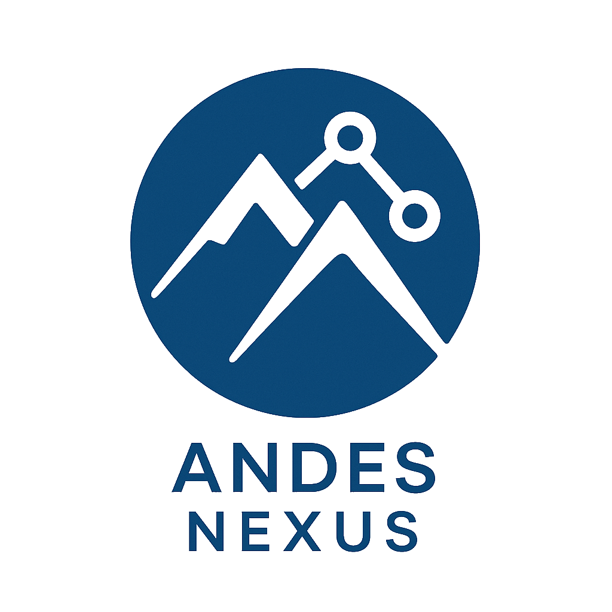

# Andes Nexus

  
  
  ### *Conectando tecnología con soluciones reales*
  
  
  
  

---

## 🚀 ¿Quiénes Somos?

**Andes Nexus** es una empresa de tecnología especializada en transformar ideas en soluciones digitales innovadoras. Desde Chile hacia América Latina, conectamos empresas con el futuro digital.

### 🎯 Nuestra Misión
Democratizar el acceso a soluciones tecnológicas de vanguardia para empresas de todos los tamaños, creando un puente entre la innovación global y las necesidades locales.

---

## 💼 Nuestros Servicios

<table>
<tr>
<td width="50%">

### 🌐 **Desarrollo Web**
- Sitios web modernos y responsivos
- Aplicaciones web progresivas (PWA)
- E-commerce y plataformas digitales
- Framework: Astro, React, Vue, Next.js

</td>
<td width="50%">

### 🚀 **DevOps & Cloud**
- Infraestructura como código
- CI/CD pipelines
- Despliegues automatizados
- Cloudflare, AWS, Azure, GCP

</td>
</tr>
<tr>
<td>

### 💡 **Consultoría Digital**
- Estrategias de transformación digital
- Auditorías tecnológicas
- Arquitectura de soluciones
- Optimización de procesos

</td>
<td>

### 🛠️ **Soporte & Mantenimiento**
- Soporte técnico 24/7
- Monitoreo proactivo
- Actualizaciones y mejoras
- Respaldo y recuperación

</td>
</tr>
</table>

---

## 📊 Nuestros Números

| 🎯 Proyectos | 👥 Clientes | 📅 Años | 🔧 Soporte |
|:------------:|:----------:|:--------:|:-----------:|
| **100+**     | **50+**    | **5+**   | **24/7**    |
| Completados  | Satisfechos| Experiencia| Técnico   |

---

## 🛠️ Stack Tecnológico

### Frontend

### Backend & Cloud

### Herramientas

---

## 🏗️ Proyectos Destacados

### 🌟 [Andes Nexus Corporate Site](https://github.com/amurpo/andes-nexus)
**Sitio web corporativo moderno**
- ⚡ Astro 5 + Tailwind CSS
- 🚀 Deploy en Cloudflare Workers
- 📱 Diseño responsivo con mosaicos interactivos
- 🎨 Animaciones CSS personalizadas

*Tecnologías: Astro, Tailwind, Cloudflare Workers*

---

## 💡 Nuestros Valores

| 🚀 **Innovación** | 🤝 **Colaboración** | ✅ **Calidad** |
|:----------------:|:------------------:|:--------------:|
| Siempre buscamos las últimas tecnologías | Trabajamos como socios estratégicos | Comprometidos con la excelencia |

---

## 📞 ¿Cómo trabajamos?

1. **🎯 Análisis** - Entendemos tus necesidades específicas
2. **📋 Planificación** - Diseñamos una estrategia personalizada  
3. **⚡ Desarrollo** - Implementamos con las mejores prácticas
4. **🚀 Entrega** - Desplegamos y optimizamos
5. **🛠️ Soporte** - Mantenimiento y mejoras continuas

---

## 🌎 Contacto

**¿Listo para transformar tu negocio?**

**Ubicación**: Chile 🇨🇱  
**Cobertura**: América Latina 🌎

---

### 🤝 Colaboraciones

Estamos abiertos a colaboraciones con otros desarrolladores y empresas.  
¡No dudes en contactarnos para explorar oportunidades!

---

**Andes Nexus** - *Conectando el futuro digital*

⭐ *¡Síguenos en GitHub para estar al día con nuestros proyectos!*

